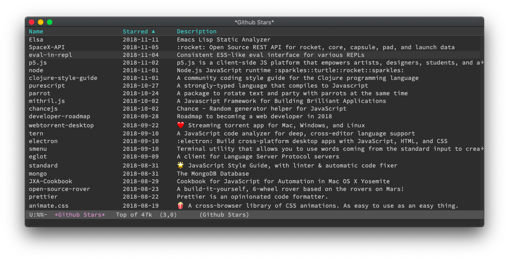

# github-stars.el -- Browse your Github Stars

## Usage

### `M-x github-stars-browse-url`

Prompt you for one of your github stars and open it in the web browser.

### `M-x github-stars-list`

Display a list of your github stars.
